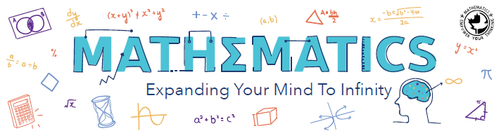

# Project in Mathematics 2
Repository of RMUTT 09115406: Project in Mathematics 2

## Course Description

ฝึกทำวิจัยโดยการศึกษาค้นคว้าอย่างอิสระในสาขาคณิตศาสตร์ คณิตศาสตร์ประยุกต์ หรือสาขาที่ใกล้เคียง นำเสนอผลการศึกษาพร้อมส่งรายงานฉบับสมบูรณ์ภายใต้การดูแลและให้คำปรึกษาของอาจารย์ที่ปรึกษาโครงงาน

Practice on conduction a research in mathematics applied mathematics or related fields, presentation and report writing in mathematical project, by consideration of project advisor

## Course Schedule

| กิจกรรม    | วันที่  |  เวลา |  หมายเหตุ   |
|----------|------|-------|-----------|
| ส่งเล่มรายงานครั้งที่ 1 | 21 มกราคม 2565 | 16.00 น. | ส่งผ่าน Assignment ของ MS Teams |

## Report Templates

ให้นักศึกษาใช้ Template ในรูปแบบของ LaTeX ดังที่กำหนดให้ต่อไปนี้

| Template |          |
|----------|----------|
| เล่มรายงาน - ภาษาไทย   | [Download](./templates/thai_template.zip) |
| เล่มรายงาน - English  | [Download](./templates/english_template.zip) |

หากพบปัญหาในการใช้งาน ให้นักศึกษารายงานต่ออาจารย์ที่ปรึกษาหรือสาขาวิชา
ทั้งนี้ไม่อนุญาตให้ดัดแปลงไฟล์คลาส (`*.cls`) ของรายงานโดยเด็ดขาด

## List of Projects

To be annoumnced ...
